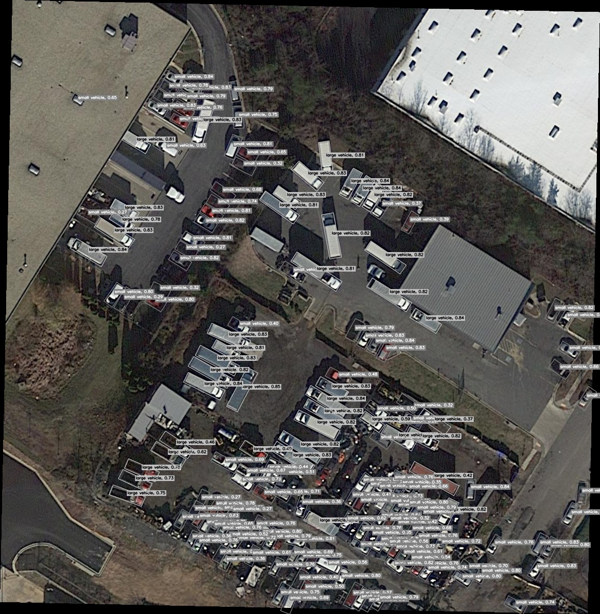
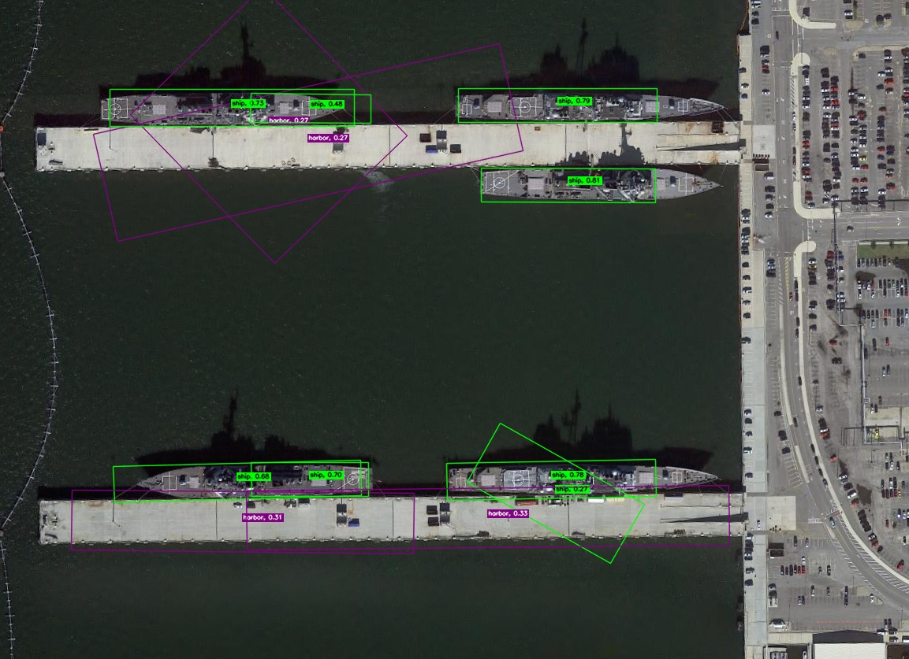
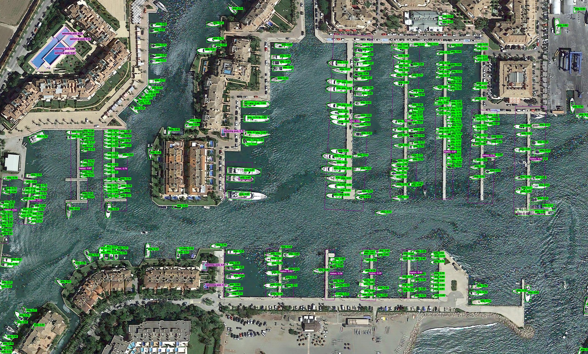
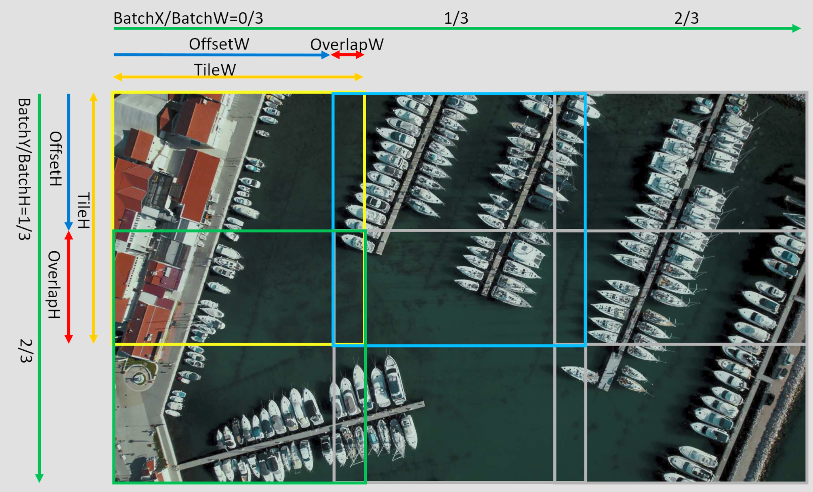
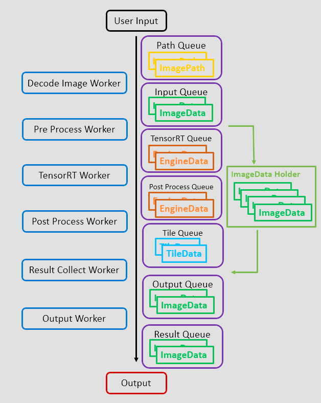
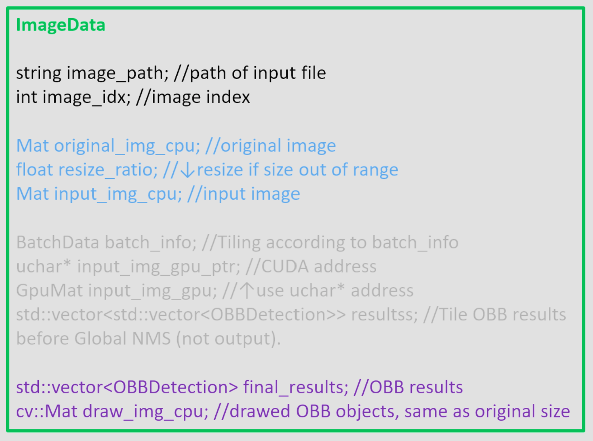

# YOLOv11-OBB-TensorRT-HighResTiling-MT-CPP
You Only Look Once (YOLO) version 11 Oriented Bounding Boxes Object Detection on NVIDIA TensorRT and High Resolution Tiling on NVIDIA CUDA with Multi Threading GPU Stream in C++ Code

## Introduction
The major usage of OBB is the aerial image which may be very high resolution with very small object. In such case, tiling original image into small tile and inference can detect such a small object.

YOLOv11 OBB can detect oriented boudning boxes objects with very low latency with TensorRT on NVIDIA GPU.

However, the bottleneck may be the pre-process and post-process. Also the Non-Max-Supression (NMS) process may even slower when amount of candidate objects increased.

This project doing CPU Image Decode -> CUDA pre-processing -> CUDA TensorRT Inference -> CUDA post-processing with multithread CUDA stream to make better throughput.

We can inference different image size with same TensorRT engine by tiling the image into small tile and concat different images's tile into one batch then inference. (also can split image tile into multiple batch)






## Detail
### Image Tiling
We will tiling image into small tile which the size is same as model input size then inference. min_overlap_h and min_overlap_w control the minimum overlap_h and overlap_w, if image smaller than model input size then it will resize to model input size and keep aspect ratio, if image larger than max_img_size then it will downscale and keep aspect ratio in order to fit GPU memory space. (to avoid repeating cudaMalloc call to make higher throughput)


The CUDA pre-processing, CUDA TensorRT inference and CUDA post-processing will use the same CUDA stream and Async call to all CUDA kernel and TensorRT kernel.

### Work Flow
```
Decode Image Worker: Read image from path in CPU, resize if required, and transfer image to CUDA.
Pre Process Worker: Doing YOLOv11-OBB Pre-Processing in CUDA.
TensorRT Worker: Doing YOLOv11-OBB TensorRT Inference in CUDA.
Post Process Worker: Doing YOLOv11-OBB Post-Processing in CUDA (Tile NMS) and trasfer batch result to CPU.
Result Collect Worker: Grab the result from TileData and map to ImageData Holder in CPU.
Output Worker: Doing Global NMS between each Tile's results in CPU.
```


### Output Format


## Setup Compiler Environment

This project using OpenCV with CUDA support to transfer Mat to GpuMat, so you need to compile OpenCV with CUDA support.

```
A. Visual C++ Compiler
  1. Install Visual Studio 2022 with C++ Desktop Environment (MSVC, Clang...)
  2. Microsoft Visual C++ (MSVC) must installed before install NVIDIA CUDA (if not, you need to copy files from "C:\Program Files\NVIDIA GPU Computing Toolkit\CUDA\v12.8\extras\visual_studio_integration\MSBuildExtensions" to "C:\Program Files\Microsoft Visual Studio\2022\Community\MSBuild\Microsoft\VC\v170\BuildCustomizations")

B. NVIDIA CUDA / CUDNN / TensorRT
  1. Install CUDA_12.8.0
  2. Install CUDNN 9.10.2.21 by installer or Unzip CUDNN 9.10.2.21 for CUDA 12 to CUDA folder: "C:\Program Files\NVIDIA GPU Computing Toolkit\CUDA\v12.8" (Tarball: "cudnn-windows-x86_64-9.10.2.21_cuda12-archive.zip")
  3. Unzip TensorRT-10.12.0.36 to "D:\Compile" and final path will be "D:\Compile\TensorRT-10.12.0.36.Windows.win10.cuda-12.9\TensorRT-10.12.0.36"
  4. Running to launch envrinment variables setting: rundll32 sysdm.cpl,EditEnvironmentVariables
  4a. add "C:\Program Files\NVIDIA\CUDNN\v9.10\bin\12.9" to $PATH
  4b. add "D:\Compile\TensorRT-10.12.0.36.Windows.win10.cuda-12.9\TensorRT-10.12.0.36\bin" to $PATH
  4c. add "D:\Compile\TensorRT-10.12.0.36.Windows.win10.cuda-12.9\TensorRT-10.12.0.36\lib" to $PATH

C. OpenCV
  1. Install CMake 4.0.3
  2. Download and unzip Source of opencv 4.11.0 to D:\Compile\OpenCV-4.11.0
  3. Download and unzip Source of opencv_contrib 4.11.0 to D:\Compile\OpenCV-4.11.0
  4. Use CMake-GUI and select source code folder: "D:/Compile/OpenCV-4.11.0/opencv" and select build the binaries folder: "D:/Compile/OpenCV-4.11.0/build"
  5. Click Configure in CMake-GUI and choose generator "Visual Studio 17 2022", platfrom "x64" and Use default native compiler then Finish and wait until finish configure.
  6. Checked: "WITH_CUDA", "BUILD_opencv_world", 
  7. Filled: OPENCV_EXTRA_MODULES_PATH: "D:/Compile/OpenCV-4.11.0/opencv_contrib/modules" <use slash, not backslash>
  9. Click Generate in CMake-GUI and wait until finish. And check the output ("NVIDIA CUDA: YES (ver 12.8)")
  10. Now you can open "D:\Compile\OpenCV-4.11.0\build\OpenCV.sln" to launch the VC++ Projects that CMake builded.
  11. Compile target "CMakeTargets/INSTALL" with x64/Release (opencv_wrold4110.lib) and x64/Debug (opencv_world4110_d.lib) <compiling may take few hours>
  12. Go to path "D:\Compile\OpenCV-4.11.0\build\install" and check "x64\vc17\lib\opencv_world4110.lib" and "x64\vc17\bin\opencv_world4110.dll" exist.
  13. add "D:\Compile\OpenCV-4.11.0\build\install\x64\vc17\bin" to $PATH (run: rundll32 sysdm.cpl,EditEnvironmentVariables)
  a1. Optional: OpenCV build with CUDNN, which can use OpenCV framwork to inference the model. (WITH_CUDNN=True, CUDNN_LIBRARY="C:/Program Files/NVIDIA/CUDNN/v9.10/lib/12.9/x64/cudnn.lib", CUDNN_INCLUDE_DIR="C:/Program Files/NVIDIA/CUDNN/v9.10/include/12.9")
  a2. Optional: Unzip NVIDIA Video Codec SDK 12.1.14 to CUDA folder (just like CUDNN Tarball) to support NVCUVID. (Use NVIDIA hardware decoder to read video frame from video file and NVIDIA hardware encoder to write video frame to video file)

```

## Export TensorRT engine 

### Convert .pt to .onnx
Convert PyTorch model to ONNX model
```
cd yolov11-obb-exports
python pt2onnx.py
```

### Convert .onnx to .trt (.engine)
Convert ONNX model to TensorRT engine
You can adjust the (BatchSize)x(Channel)x(TileH)x(TileW) in minShapes (minimum), optShapes (optimal) and maxShapes (maximum) with your need.
```
cd yolov11-obb-exports
onnx2trt.bat
cp yolo11n-obb-fp16.trt ../yolov11-obb-tensorrt/yolov11-obb-tensorrt
```

## Compile Inference Program
### Setup 
```
launch yolov11-obb-tensorrt/yolov11-obb-tensorrt.sln
select Release/x64
Build the program
```

## YOLOv11_OBB_TRT usage

### Initialize:
```
bool YOLOv11_OBB_TRT::init(int engine_threads, //CUDA parallel count, how many CUDA stream which affect CUDA buffer VRAM usage
    int image_threads, //CPU parallel count, how many thread doing image deocde and global NMS (NMS between each neighbor tile, *NMS inside each tile is done by CUDA)
    const char* engine_path, //path of TensorRT engine (.trt or .engine)
    int num_classes, //Model Number of Classes (15 for official model which trained with DOTAv1 dataset)
    int batch_size, //Batch Size of TensorRT engine
    int tile_h, //Height of TensorRT engine
    int tile_w, //Width of TensorRT engine
    int min_overlap_h, //Minimum Overalp of each Tile of Image, Dynamic Tilining parameter
    int min_overlap_w, //Minimum Overalp of each Tile of Image, Dynamic Tilining parameter
    float conf_thres, //Confidence Score Threshold of post processing
    float iou_thres, //Intersection Over Union Threshold of post processing
    bool draw_bboxes, //Draw Bboxes to cv::Mat draw_img_cpu in output ImageData
    bool output_draw, //Output the draw_img_cpu to (filename)_obb.jpg
    bool output_csv, //Output to (filename)_obb.csv
    std::string result_folder_prefix, //Result Folder prefix (if set "_obb_results" then input C:/test/images/P0006.png will output to C:/test/images_obb_results/P0006.png_obb.jpg)
    std::vector<std::string> CLASSES, //Model Class Names
	std::vector<cv::Scalar> COLORS //Bboxes Draw Color for each Class
    )
```

Initial and Run:
```
inferencer.init(8, 8, "yolo11n-obb-fp16.trt", 15, 16, 1024, 1024, 256, 256, 0.25, 0.45, true, false, false, "_obb_results", CLASSES, COLORS);
for (int i = 0;i < image_paths.size();++i) {
    inferencer.enqueue(image_paths[i]); //Input the image path to Inferencer
}
for (int i = 0;i < image_paths.size();++i) {
    ImageData im=inferencer.dequeue(); //Output from Inferencer (Blocking until first data out)

    cv::imshow("results", im.draw_img_cpu); //Draw Image
    cv::waitKey(1);
    
    /*
    std::string image_path = im.image_path;
    std::cout << "Image Path: " << image_path << std::endl;
    for (int j = 0;j < im.final_results.size();++j) {
        float x = im.final_results[j].x; //OBB X position
        float y = im.final_results[j].y; //OBB Y position
        float w = im.final_results[j].w; //OBB Width
        float h = im.final_results[j].h; //OBB Height
        float a = im.final_results[j].angle; //OBB Angle
        float s = im.final_results[j].score; //OBB Confidence Score
        int c = im.final_results[j].class_id; //OBB Class Index
        std::cout << "x: " << x << ", y: " << y << ", w: " << w << ", h: " << h
            << ", angle: " << a << ", score: " << s << ", class: " << CLASSES[c] << std::endl;
    }
    */
}
```

## Performance
Test with DOTAv1 test images with dynamic resolution from 211x521 to 10240x4096, image smaller than 1024 (tile_h, tile_W) or larger than 8192 (max_img_size) will be resized. (we can increase max_img_size but consume more GPU VRAM)

Our code achieve 271.143 FPS of (3x1024x1024) on YOLOv11n-OBB with RTX4070 Ti Super 16GB (Including reading and decoding original image, tiling on original image, concat the result and draw result on original image)

```
Image Count: 937 files

TensorRT Engine: YOLOv11n-OBB
(BatchSize)x(Channel)x(TileHeight)x(TileWidth)=16x3x1024x1024

Hardware:
CPU: AMD Ryzen 7 5700X3D
GPU: NVIDIA RTX4070 Ti Super 16GB (PCIe Gen4x16)
RAM: 128GB (DDR4-3600 32GBx4 CL18)
SSD: 2TB (NVMe Gen4x4, AMD RAID1)

draw bboxes and output to screen, no output to file
Execution Time: 43442 ms TensorRT Buffer Rate: 852.943 MB/s Image Buffer Rate: 465.235 MB/s Image Rate: 21.569 FPS Tile Rate: 271.143 FPS

draw bboxes and output to screen, output to .jpg and .csv
Execution Time: 49087 ms TensorRT Buffer Rate: 754.854 MB/s Image Buffer Rate: 411.733 MB/s Image Rate: 19.0886 FPS Tile Rate: 239.962 FPS

(Execution Time) The time between first input and final output.
(TileCount) How many tiles is the image split into.
(ImageSize)=(ImageWidth)x(ImageHeight)x(Channel)
(Tile Rate)=(TileCount)/(Execution Time)
(Image Rate)=(ImageCount)/(Execution Time)
(TensorRT Buffer Rate)=3x1024x1024x(TileRate)
(Image Buffer Rate)=(ImageSize)x(ImageRate)
```

## Need to know before downstream task
- The max objects size in the tile can be set as max_object_count_per_tile_after_nms (default:512) which means objects count larger than 512 insdie tile (1024x1024) may cause the loss of some objects.
- (CPU to GPU) or (GPU to CPU) Memory Copy is the major bottleneck for PC build. Due to the PCI-E bandwidth is limited.
- Objects memory buffer (batch_size)x(max_object_count_per_tile_after_nms)x(7) will transfer from GPU to CPU, so the smaller max_object_count_per_tile_after_nms have better throughput. *(7) is x,y,w,h,a,score,class in fp32
- Candidate objects memory buffer (batch_size)x(max_object_count_per_tile_before_nms)x(8) always keep in GPU memory, no transfer over PCI-E after init. (default:16384)
- The size of max_object_count_per_tile_*_nms may impact the maximum atomicAdd count. Must take care the trade-off between speed and max objects limit.

## Future Work
- MultiGPU: I don't have multiple NVIDIA GPU in same PC in my home right now. So I didn't write this part due to I can't test it.
